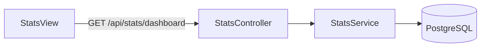

# Analytics

Real-time analytics for the admin dashboard, backed by PostgreSQL aggregates.

## Flow

## Feature flags

| Server | Admin |
|--------|-------|
| `FEATURE_STATS_API=true` | `NEXT_PUBLIC_FEATURE_STATS_API=true` |

Requires `FEATURE_CHAT_PERSISTENCE=true` and a populated database. Without data, charts show zeros.

## API

All routes require `Authorization: Bearer <jwt>`.

| Method | Path | Response |
|--------|------|----------|
| `GET` | `/api/stats/status` | `{ statsApiEnabled: boolean }` |
| `GET` | `/api/stats/dashboard` | `AnalyticsDashboard` |

### AnalyticsDashboard shape

Defined in `@intracom/contracts`:

- **overview** — `messagesToday`, `messagesYesterday`, `openConversations`, `resolvedConversations`, `avgResponseTimeMs`
- **hourlyVolume** — message counts in 4-hour buckets (last 24h)
- **dailyActivity** — messages and new conversations per day (last 7 days)
- **statusBreakdown** — open vs resolved counts (pie chart)

### Average response time

Computed over the last 7 days: for each visitor message immediately followed by an admin reply in the same conversation, measure the time delta and average.

## Admin UI

`admin/src/components/stats/StatsView.tsx` loads data via `admin/src/lib/stats-api.ts`.

KPI cards:

- Messages today (trend vs yesterday)
- Open conversations
- Average response time

Charts replace previous placeholder data.

## Local testing

1. `docker compose up -d`
2. `cd server && npx prisma migrate dev`
3. Send messages via widget or socket client
4. Open [http://localhost:3001/stats](http://localhost:3001/stats)

## Troubleshooting

| Symptom | Check |
|---------|--------|
| "Analytics unavailable" | `FEATURE_STATS_API`, JWT, Postgres |
| All zeros | No messages in DB yet |
| 503 | `FEATURE_STATS_API=false` on server |
