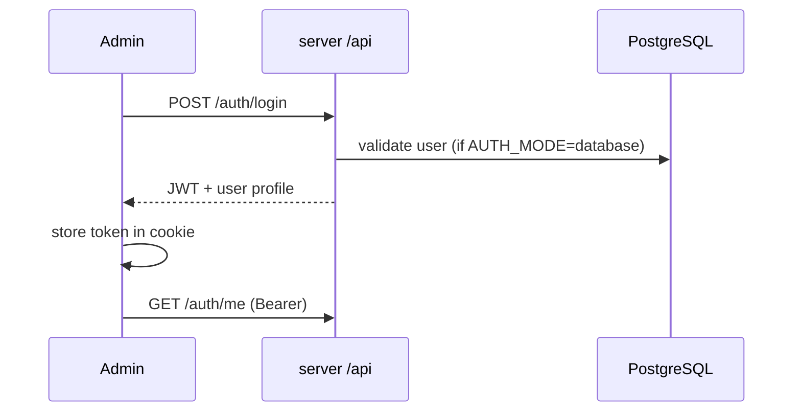
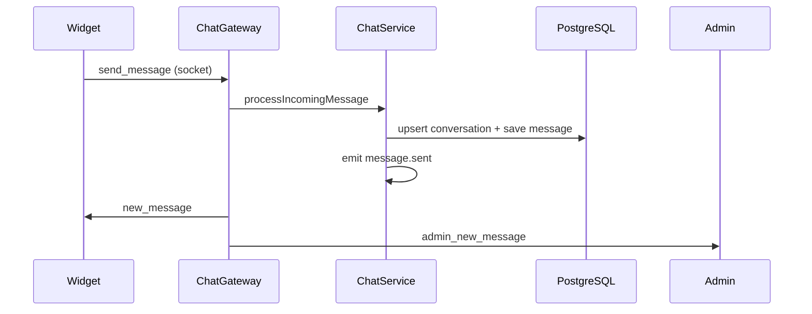
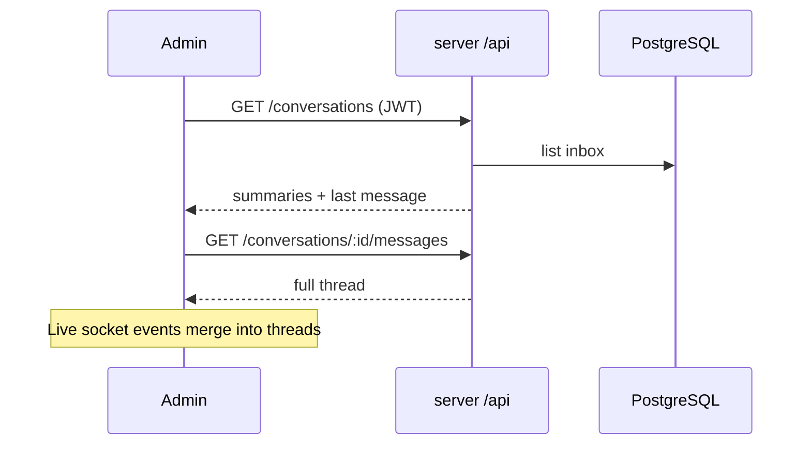
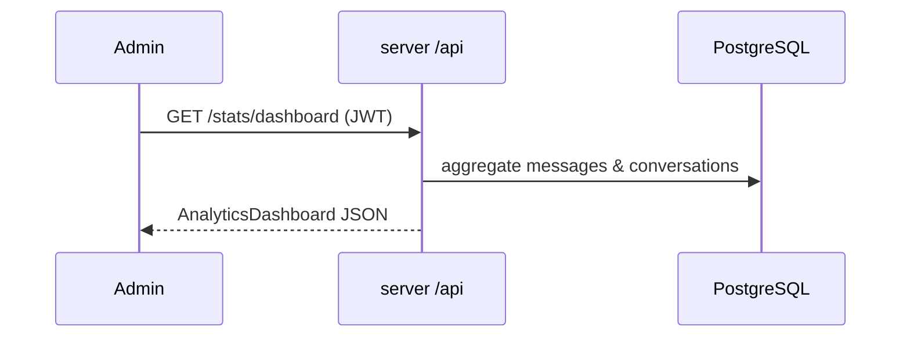

# Architecture

Intracom is a monorepo today with separate deployable apps. Shared types live in `@intracom/contracts`; UI lives in `intracom-ui`.

## Repository layout

```text
Intracom/
├── contracts/          @intracom/contracts — shared types & event names
├── frontend-library/   intracom-ui — React component library
├── server/             NestJS API + Socket.IO + Prisma
├── admin/              Next.js admin dashboard
├── widget/             Preact embeddable chat widget
└── docs/               Developer guides (you are here)
```

## High-level diagram

```mermaid
flowchart TB
  subgraph clients
    W[Widget Preact]
    A[Admin Next.js]
  end

  subgraph shared
    C[@intracom/contracts]
    UI[intracom-ui]
  end

  subgraph backend
    S[NestJS server]
    DB[(PostgreSQL)]
    R[(Redis optional)]
  end

  W -->|Socket.IO| S
  A -->|REST + Socket.IO| S
  W --> C
  A --> C
  A --> UI
  S --> C
  S --> DB
  S --> R
```

## Request flows

### 1. Admin login



### 2. Visitor sends a message (widget)



### 3. Admin opens inbox (persisted)



### 4. Analytics



## Feature flags

Server and admin use env-based flags so you can develop without PostgreSQL, then enable persistence in staging.

| Concern | Server env | Admin env |
|---------|------------|-----------|
| Auth | `FEATURE_AUTH_ENABLED`, `AUTH_MODE` | `NEXT_PUBLIC_FEATURE_MOCK_AUTH` |
| Socket JWT | `FEATURE_SOCKET_AUTH` | `NEXT_PUBLIC_FEATURE_SOCKET_AUTH` |
| Chat REST | `FEATURE_CHAT_API` | `NEXT_PUBLIC_FEATURE_CHAT_API` |
| Persistence | `FEATURE_CHAT_PERSISTENCE` | — |
| Stats | `FEATURE_STATS_API` | `NEXT_PUBLIC_FEATURE_STATS_API` |

## What belongs where

| Put in contracts | Put in server | Put in admin/widget |
|------------------|---------------|---------------------|
| API response shapes | Business logic | UI state |
| Socket event names | Prisma / DB | Pages & components |
| Domain event payloads | Guards, DTOs with validators | API client wrappers |

Do **not** put NestJS modules or Prisma in `@intracom/contracts`.

## Future microservices

When you split repos:

1. Publish `@intracom/contracts` to private npm.
2. Extract first worker (e.g. email notifications) consuming `DOMAIN_EVENTS.MESSAGE_SENT`.
3. Keep the API gateway as `server/` with sockets + REST.

The monorepo `file:../contracts` link becomes `"@intracom/contracts": "^0.2.0"` per service.
