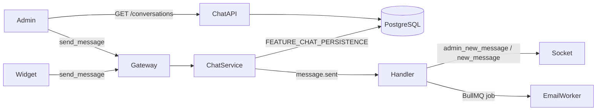

# Chat persistence and inbox API

Intracom chat supports real-time messaging over Socket.IO and optional persistence to PostgreSQL. The admin dashboard can load conversation history from REST endpoints so threads survive page refresh.

## Architecture



## Feature flags

| Server | Admin | Purpose |
|--------|-------|---------|
| `FEATURE_CHAT_API` | `NEXT_PUBLIC_FEATURE_CHAT_API` | REST inbox and message history |
| `FEATURE_CHAT_PERSISTENCE` | — | Save conversations/messages to DB |
| `DEFAULT_APP_ID` | — | Tenant id for new conversations |
| `FEATURE_SOCKET_AUTH` | `NEXT_PUBLIC_FEATURE_SOCKET_AUTH` | JWT on socket handshake |

Defaults (local dev): chat API and persistence **on**.

## API endpoints

All routes require `Authorization: Bearer <jwt>` (same token as `/api/auth/login`).

| Method | Path | Description |
|--------|------|-------------|
| `GET` | `/api/conversations/status` | Feature flag status |
| `GET` | `/api/conversations` | Inbox list (`?status=open&limit=50`) |
| `GET` | `/api/conversations/:id` | Conversation metadata |
| `GET` | `/api/conversations/:id/messages` | Message history (`?limit=100`) |
| `PATCH` | `/api/conversations/:id/status` | Set `open` or `resolved` |

Socket event names are defined in `@intracom/contracts` (`SOCKET_EVENTS`).

- Client → server: `send_message` with `{ conversationId, senderId, text, isAdmin, appId? }`
- Server → visitor: `new_message` with `{ id, conversationId, senderId, text, isAdmin, timestamp }`
- Server → admin: `admin_new_message` (same payload)

## Local setup

### 1. Database

```bash
cd server
cp .env.example .env
# Set DATABASE_URL and FEATURE_CHAT_PERSISTENCE=true
npx prisma migrate dev
```

### 2. Server

Ensure Redis is running (used for Socket.IO and BullMQ):

```bash
docker compose up -d redis
```

```bash
cd server
npm run start:dev
```

### 3. Admin

```bash
cd admin
cp .env.example .env.local
# NEXT_PUBLIC_FEATURE_CHAT_API=true
npm run dev
```

Log in at `http://localhost:3001/login` (default seed: `admin@intracom.com` / `changeme`).

### 4. Widget (optional)

```bash
cd widget
npm run dev
```

Open the widget, send a message, then refresh the admin inbox — the thread should still appear when persistence is enabled.

## Testing without PostgreSQL

Set on the server:

```env
FEATURE_CHAT_PERSISTENCE=false
```

Messages still flow over sockets but are not stored. The admin REST API returns empty lists unless you enable persistence and run migrations.

## Admin data flow

`ChatProvider` merges three sources:

1. **REST inbox** — conversation summaries and last message
2. **REST history** — full thread when opening a conversation
3. **Socket** — live `admin_new_message` events

Deduplication uses message `id` when present.

## Admin features

| Feature | Implementation |
|---------|----------------|
| Inbox list | `ChatProvider` merges REST + socket |
| Search | `InboxList` filters by visitor id and message text |
| Resolve | `PATCH /conversations/:id/status` → removes from open inbox |
| Message history | `GET /conversations/:id/messages` on thread open |

See [ARCHITECTURE.md](./ARCHITECTURE.md) for sequence diagrams.

## Troubleshooting

| Symptom | Check |
|---------|--------|
| Empty inbox after refresh | `FEATURE_CHAT_PERSISTENCE=true`, migrations applied, `DATABASE_URL` valid |
| 401 on `/conversations` | Log in again; token cookie set |
| 503 on chat API | `FEATURE_CHAT_API=false` on server |
| Widget messages not in admin | Widget and admin use same server URL; conversation id in localStorage |
| Duplicate messages in UI | Server should emit stable `id` in socket payload (enabled when persistence is on) |
