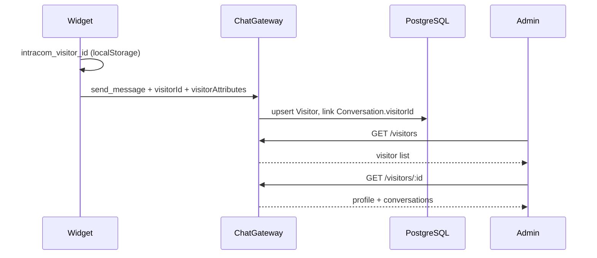

# Visitors (user profiles)

Widget visitors get a persistent profile stored in PostgreSQL with **JSONB `attributes`** for flexible metadata (page URL, user agent, custom fields).

> **Naming:** The roadmap calls this the `User` model. In code we use `Visitor` to distinguish from `AdminUser` (dashboard operators).

## Flow



## Database

```prisma
model Visitor {
  id         String   @id
  appId      String
  email      String?
  name       String?
  attributes Json     @default("{}")  // JSONB
  lastSeenAt DateTime
  conversations Conversation[]
}

model Conversation {
  visitorId String?
  visitor   Visitor?
}
```

Migration: `20260702120000_add_visitors`

## Feature flags

| Server | Admin |
|--------|-------|
| `FEATURE_VISITORS_API` | `NEXT_PUBLIC_FEATURE_VISITORS_API` |

Requires `FEATURE_CHAT_PERSISTENCE=true` for profiles to be created from widget traffic.

## API

All routes require JWT.

| Method | Path | Description |
|--------|------|-------------|
| `GET` | `/api/visitors/status` | Feature flag status |
| `GET` | `/api/visitors?search=&limit=50` | List visitors |
| `GET` | `/api/visitors/:id` | Profile + linked conversations |
| `PATCH` | `/api/visitors/:id` | Update `name`, `email`, `attributes` |

Types: `@intracom/contracts` → `VisitorSummary`, `VisitorProfile`, `UpdateVisitorPayload`.

## Widget

On each message the widget sends:

```json
{
  "conversationId": "...",
  "visitorId": "...",
  "visitorAttributes": {
    "userAgent": "...",
    "language": "en-US",
    "pageUrl": "https://..."
  }
}
```

Storage keys:

- `intracom_visitor_id` — stable visitor identity
- `intracom_conversation_id` — current thread

## Admin UI

| Route | Screen |
|-------|--------|
| `/users` | Searchable visitor table (`DataTable`) |
| `/users/[id]` | Profile editor + JSONB attributes + conversation links |

Sidebar: **Visitors** icon.

## Custom attributes

Pass arbitrary JSON from the widget or update via `PATCH /visitors/:id`:

```json
{
  "attributes": {
    "plan": "pro",
    "company": "Acme Inc"
  }
}
```

Merged on upsert when the widget sends `visitorAttributes` on new messages.

## Related

- [CHAT.md](./CHAT.md) — conversations & messages
- [PACKAGES.md](./PACKAGES.md) — contract types
- [ARCHITECTURE.md](./ARCHITECTURE.md) — system overview
